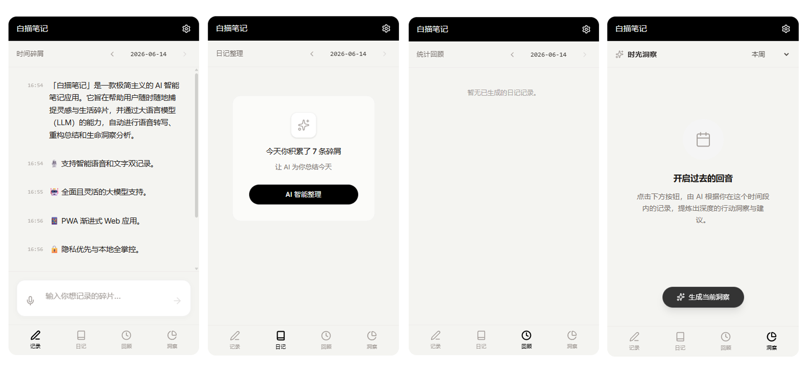

# 白描笔记 (Baimiao Notes)

> 极简主义 AI 语音笔记 · 隐私优先 · 本地全掌控



「白描笔记」是一款面向个人用户的 AI 智能语音笔记应用。随时随地捕捉灵感与生活碎片，通过大语言模型自动完成语音转写、日记聚合、统计回顾和生命洞察分析——所有数据默认存储在您的设备本地。

---

## ✨ 核心特性

### 🎙️ 智能语音记录
一键录音保存思想碎片。针对 iOS Safari 和各大移动端浏览器进行了深度音频兼容性优化，支持自动降级与 WebM / MP4 无缝切换，彻底解决部分设备录音后无法播放的问题。

### 🤖 全面且灵活的大模型支持
内置主流 AI 模型 API 接口集成，开箱即用：

| 服务商 | 默认模型 |
|--------|----------|
| Google Gemini | gemini-3.1-flash-lite |
| OpenAI (ChatGPT / Whisper) | gpt-4o-mini |
| DeepSeek | deepseek-chat |
| 火山引擎 (豆包) | doubao-seed-2-0-lite |
| Kimi (月之暗面) | moonshot-v1-8k |
| 智谱 (GLM-4) | glm-4-flash |
| MiniMax | abab6.5s-chat |
| 小米 MIMO | mimo-chat |
| 自定义 / Ollama | 任意兼容 OpenAI 格式 |

### 📝 多通道 Prompt 与 AI 双轨科学加工
采用「**默认 + 三个自定义槽位**」四通道 Prompt 设计，覆盖日记整理、统计回顾和生命洞察三大模块：

- **日记整理**：将零散碎屑一键整合为排版优美的日常日记，用户可在「默认 / 自定义一 / 自定义二 / 自定义三」中选择不同 Prompt 风格生成。系统出厂默认使用「柳比歇夫时间日志法」模板，并在「自定义 1」中预装了「贴心日记助手」模板。
- **统计回顾**：独立于日记的反思总结模块，同样支持四通道 Prompt 选择。默认 Prompt 已深度融合 **CBT 认知行为疗法（ABCDE模型）**与 **积极心理学（PERMA）**，提供富有启发性的科学反思卡片。
- **生命洞察**：基于多天数据的 AI 深度习惯分析报告。默认 Prompt 已融合 **习惯回路理论**与 **系统 1/2 精力分配**，提供强可执行度的微习惯干预方案。

### 🔄 日记与回顾完全解耦
日记和回顾使用**独立的数据表**（`daily_diaries` / `daily_reviews`），彼此不关联：

- 删除日记不影响回顾，删除回顾不影响日记。
- 同一天可以追加多篇回顾，每篇可选用不同的 Prompt。
- 回顾模块支持独立的「生成 / 重新生成 / 追加新回顾」操作。

### 💡 深度 AI 对话能力（日记 / 回顾 / 洞察全覆盖）
无论是在梳理日记、反思回顾，还是洞察卡片中，均支持展开专属的 AI 对话框：
- **无缝追问**：基于当前生成的特定文本内容，直接在卡片内向 AI 追问细节。
- **一致体验**：对话操作栏经过专门重构，删除、复制、编辑、重新生成等按键双行均匀排布，消除手机端拥挤感；同时点击正文即可快速收起卡片。
- **本地记忆**：所有的聊天记录均随相应的日记或回顾独立存放在 IndexedDB，互不干扰，关闭再次打开仍可接续对话。

### ⏰ 静默自动补发
当用户在当天 23:59 前未手动生成日记或回顾时，下次打开应用将自动检测昨日记录并**并行静默补发**：

- 日记自动补发 → 使用默认 Prompt 生成并存入 `daily_diaries`
- 回顾自动补发 → 使用默认 Prompt 生成并存入 `daily_reviews`
- 两者独立检查、并行调用，互不阻塞。

### 🔍 全局多维搜索
内置全局搜索覆盖碎屑记录、日记、回顾、洞察四个模块：

- 关键词高亮片段预览
- 按时间范围过滤（近 7 天 / 30 天 / 自定义日期区间）
- 按模块类型筛选
- 搜索历史记录

### 📱 PWA 渐进式 Web 应用
现代化的 PWA 架构支持「添加到主屏幕」，无需应用商店，即可在 iOS 和 Android 上获得媲美原生 App 的极速跟手体验与沉浸式全屏视图。

### 🔒 隐私优先与本地全掌控
基于 IndexedDB 的本地存储架构，音频文件与笔记数据默认留存在您的设备本地。所有 AI 请求通过后端安全代理层透传，API Key 等配置信息由前端注入，不在服务端存储。提供完善的数据导出能力，您的数据属于您。

### ☁️ 多云盘端到端加密同步
不仅支持纯本地使用，还内置了强大的本地优先云端同步矩阵：
- 支持 **WebDAV、Google Drive、OneDrive、Dropbox** 四大主流云盘。
- 支持 **端到端加密 (E2EE)**，备份至云端的数据（AES-GCM 加密）即使被获取也无法被解密。
- 提供手动、强制覆盖和自动合并同步能力，防篡改和数据主权并重。
- 内置针对浏览器永久存储配额（Storage Persistence）的保护检测与防护护航。

---

## 🏗️ 技术架构

| 层级 | 技术栈 |
|------|--------|
| **前端核心** | React 19 · TypeScript · Vite 6 |
| **UI & 样式** | Tailwind CSS 4 · Lucide Icons · Motion 动画 |
| **状态管理** | Zustand |
| **本地存储** | IndexedDB (Dexie.js) — 四张数据表 |
| **后端代理** | Node.js · Express (安全代理 AI 请求) |
| **部署** | Vercel Serverless Functions / 本地 Express |
| **原生化** | vite-plugin-pwa (Service Worker + 离线缓存) |
| **Markdown** | react-markdown |

### 数据库模型

```
whitewash_diary (IndexedDB)
├── raw_logs          碎屑记录（文本 + 音频 Blob）
├── daily_diaries     整合日记（AI 日记正文 + 摘要）
├── daily_reviews     统计回顾（AI 回顾正文 + 诗意摘要）— 独立于日记
└── insights          洞察缓存（周期性 AI 分析报告）
```

### 项目结构

```
baimiaobiji/
├── server.ts                 Express 开发服务端（融合 Vite 中间件）
├── api/index.ts              Vercel Serverless API（与 server.ts 同步）
├── src/
│   ├── db/db.ts              IndexedDB 数据库声明与迁移
│   ├── store/
│   │   ├── app.store.ts      核心业务逻辑（AI 生成、搜索、静默补发）
│   │   └── settings.store.ts 大模型配置与 Prompt 持久化
│   ├── pages/
│   │   ├── Record.tsx        碎屑记录与语音录入
│   │   ├── Diary.tsx         AI 日记整合编辑
│   │   ├── Review.tsx        统计回顾（独立数据表）
│   │   ├── Insights.tsx      生命洞察分析
│   │   └── Settings.tsx      大模型连接与 Prompt 配置
│   └── components/
│       ├── Layout.tsx        全局布局、搜索、静默补发触发
│       ├── CalendarHeatmap.tsx 日历热力图
│       └── MiniCalendar.tsx  日期选择器
├── vercel.json               Vercel 路由配置
└── vite.config.ts            Vite + PWA 构建配置
```

---

## 🚀 快速开始

### 环境要求
- Node.js ≥ 18
- npm ≥ 9

### 安装与运行

```bash
# 1. 克隆仓库
git clone https://github.com/haotianliangye/baimiaobiji.git
cd baimiaobiji

# 2. 安装依赖
npm install

# 3. 启动开发服务器（默认端口 3000）
npm run dev

# 4. 构建生产版本
npm run build

# 5. 启动生产服务器
npm start
```

### Vercel 一键部署

项目已内置 `vercel.json` 配置，直接连接 GitHub 仓库至 Vercel 即可自动部署。

---

## ⚙️ 使用与配置说明

### 1. 设置大模型参数
首次启动后，点击右上角「设置 ⚙️」图标进入系统设置页：

- 选择偏好的 AI 服务商（如 DeepSeek, Gemini, Kimi 等）
- 填入对应服务商的 **API Key**（界面内置了快捷申请链接供参考）
- 如使用局域网本地模型或第三方代理，可自行修改 `Base URL` 与 `Model`

### 2. 定制化 Prompt

在设置的「Prompt 提示词配置」一栏，日记整理、统计回顾和生命洞察均可独立选择 `默认` 或 `自定义 1/2/3`：

- 切换到 `默认` 时文本框置灰只读，显示系统出厂设定
- 切换到 `自定义 1/2/3` 时即可编辑，保存后对应模块即刻生效
- 日记模块的 `默认` 为「柳比歇夫时间日志法」模板，`自定义一` 预装了原有的「贴心日记助手」模板

### 3. 生成交互逻辑

- **日记 / 回顾**：点击「AI 智能整理 / AI 智能回顾」按钮后，弹出 Prompt 选择菜单。当配置了多套自定义 Prompt 时，可点击「✨ 全部生成 (N 套)」一键批量生成多套结果（自带限速与浮动进度条，防止 API 并发受限）。
- **静默补发**：应用启动时自动检查昨天的记录，如有碎屑但缺日记或回顾，将在后台并行静默生成。

---

## 📱 手机端无感安装 (PWA)

得益于 PWA 支持，「白描笔记」提供免安装的原生体验：

- **🍎 iOS / iPhone (Safari)**：
  Safari 打开应用 → 点击底部「分享」图标 → 选择 **「添加到主屏幕」**

- **🤖 Android / 鸿蒙 (Chrome)**：
  Chrome 打开应用 → 底部出现安装提示时点击；或点击右上角 ⋮ → **「安装应用」**

安装后即可以独立 App 形式全屏打开，无需经过应用商店。

---

## 🔌 后端 API 路由

| 路由 | 用途 |
|------|------|
| `POST /api/generate-timeline` | 日记生成（正文 + 摘要 + 回顾） |
| `POST /api/generate-review` | 独立回顾生成（正文 + 诗意摘要） |
| `POST /api/generate-insights` | 生命洞察分析报告 |
| `POST /api/insight-chat` | 基于洞察报告上下文的 AI 追问 |
| `POST /api/diary-chat` | 基于个人日记上下文的 AI 追问 |
| `POST /api/review-chat` | 基于反思回顾上下文的 AI 追问 |
| `POST /api/transcribe` | 语音转写代理（支持 ffmpeg 格式转换） |
| `ALL /api/webdav-proxy`| WebDAV 代理端点（绕过浏览器 CORS 限制）|

所有接口的 API Key、Base URL、Model 均通过请求体中的 `settings` 对象由前端透传，后端不保留任何密钥。

---

## 📄 License

MIT
