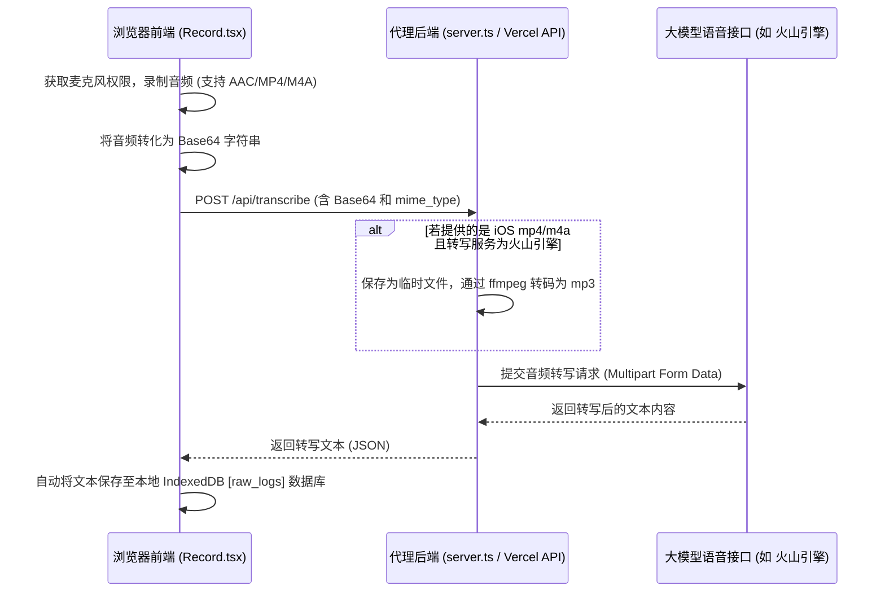
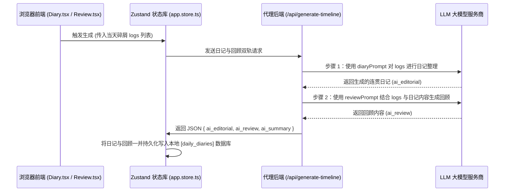
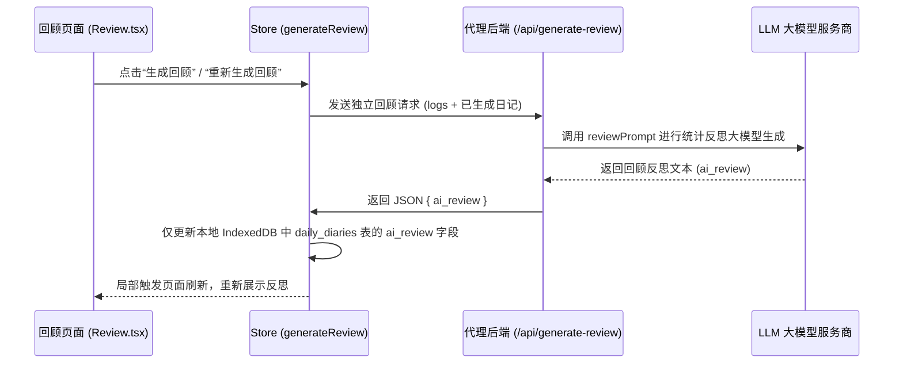

# 白描笔记 (Baimiao Notes) — 系统架构与开发维护手册

本文档提供「白描笔记」的系统设计、数据流架构、数据库逻辑关系、API 集成指南及常见故障排查手册，便于人类团队、下游接入者及新开发助手快速上手。

---

## 1. 系统概览与设计哲学

「白描笔记」采用 **本地优先 (Local-First)** 与 **云端 AI 辅助 (Cloud-Assisted)** 的双重架构：
* **存储端**：依托浏览器底层的 IndexedDB 实现全离线、高容量的音频与文本本地安全存储。
* **计算端**：应用不提供中心化云数据库，而是通过极简的后端代理将 API 调用转发至用户自备的各类主流大模型（Google Gemini、OpenAI、DeepSeek 等）。
* **UI/UX**：以沉浸式单页应用形式呈现，通过渐进式 Web 应用 (PWA) 规范实现全屏启动与 Service Worker 强缓存，使得 web app 在移动端拥有原生般的启动与交互速度。
* **移动端视口锁定与防回弹**：为避免移动端浏览器（特别是 iOS Safari）因下拉或边缘拉伸触发底座弹性偏移（橡皮筋回弹）导致界面截断，全局 `html`、`body` 必须限制为 `overflow: hidden` 与 `overscroll-behavior: none`。所有页面内容区域自主通过局部 `overflow-y-auto` 独立容器管理滚动，禁止依靠 body 级原生滚动。

---

## 2. 核心架构与数据流图

应用主要通过以下两个核心数据处理流工作：

### 2.1 移动端音频录制与转写流
为了让 iOS Safari 和 Android 浏览器都能成功录音并转写，系统设计了以下音频流处理路径：



### 2.2 日记与反思回顾生成解耦设计
在白描笔记中，日记生成与回顾生成已完全在数据层面与逻辑层面实现解耦。当用户在日记页面触发“AI 智能整理”时：



对于缺少 `ai_review` 的历史老旧条目，或者用户在“统计回顾”页面点击“重新生成回顾”时，会发起**独立回顾请求**。此外，回顾页面的卡片已限制为仅根据当前所选日期 `dateStr` 进行过滤展示，确保回顾交互与日记日期保持严格联动，且重新生成的反思依然对应其历史所属的日期。



---

## 3. 数据库表定义

数据通过本地 IndexedDB (由 Dexie.js 代理) 维护，以下是表关系说明：

1. **`raw_logs`**：
   - 记录最底层的语音碎屑文本、原始音频 Blob 及录音时长。
   - `created_at` 字段为本地毫秒级时间戳。通过 `format(new Date(created_at), 'yyyy-MM-dd')` 可按日对齐至特定日记。
2. **`daily_diaries`**：
   - 整合日记的主表。
   - `diary_date` 作为外部唯一标识的日期字符串（格式为 `YYYY-MM-DD`）。
   - `ai_editorial` 保存最终的整理日记，`ai_review` 保存专门的反思内容。
3. **`insights`**：
   - 存储对某一段时间（如周、月）的分析快照。

---

## 4. 后端 API 接口调用示例

### 4.1 `/api/generate-timeline` (日记/回顾双轨生成)
* **请求方式**：`POST`
* **Curl 示例**：
  ```bash
  curl -X POST http://localhost:3000/api/generate-timeline \
    -H "Content-Type: application/json" \
    -d '{
      "date": "2026-06-15",
      "timezone": "Asia/Shanghai",
      "logs": [{"id": "1", "content": "完成了 neat-freak 洁癖收尾", "created_at": 1781512800000}],
      "settings": {
        "provider": "gemini",
        "apiKey": "YOUR_GEMINI_KEY",
        "baseUrl": "https://generativelanguage.googleapis.com",
        "model": "gemini-3.1-flash-lite",
        "diaryPrompt": "...",
        "reviewPrompt": "..."
      }
    }'
  ```

### 4.2 `/api/generate-review` (独立回顾生成)
* **请求方式**：`POST`
* **Curl 示例**：
  ```bash
  curl -X POST http://localhost:3000/api/generate-review \
    -H "Content-Type: application/json" \
    -d '{
      "date": "2026-06-15",
      "timezone": "Asia/Shanghai",
      "logs": [{"id": "1", "content": "完成了 neat-freak 洁癖收尾"}],
      "diaryContent": "今天完成了白描笔记的系统架构文档编写...",
      "settings": {
        "provider": "gemini",
        "apiKey": "YOUR_GEMINI_KEY",
        "baseUrl": "https://generativelanguage.googleapis.com",
        "model": "gemini-3.1-flash-lite",
        "reviewPrompt": "你是一个反思助手..."
      }
    }'
  ```

---

## 5. 运维与故障排查指南 (Runbook)

### 5.1 本地后端进程没有随代码重启 (404 错误)
* **现象**：前端触发大模型时，请求返回 `Status: 404` 或弹出“AI 服务响应异常”。
* **原因**：本地通过 `tsx server.ts` 启动时，代码被编辑后并没有自动重启进程。
* **解决办法**：
  1. 在终端查看占用端口的 PID：
     ```powershell
     netstat -ano | findstr :3000
     ```
  2. 强制杀死该进程（假设 PID 为 12345）：
     ```powershell
     taskkill /f /pid 12345
     ```
  3. 重新执行 `npm run dev` 即可。

### 5.2 火山引擎在 iOS 手机端转写报错
* **现象**：在 iPhone 上录音并转写时，提示转写接口报错。
* **原因**：iOS 导出的音频是 `audio/mp4` 格式，火山引擎 API 无法直接识别。
* **解决办法**：确保本地后端服务器的执行路径中安装了 `ffmpeg`（项目依赖已内置 `@ffmpeg-installer/ffmpeg`），后端会在接收到 mp4 格式后自动调用 ffmpeg 转码为 mp3 后再发送。

---

## 6. 变更日志 (Milestones)

* **2026-06-14**：新增“提示词四通道”模板选择机制。支持 `默认` 槽位和 3 个 `自定义` 配置槽位（配置版本升至 v2），支持根据所选槽位动态渲染只读/编辑输入框。
* **2026-06-15**：实现统计回顾与日记生成逻辑完全解耦。在数据库中增加 `ai_review` 字段，增加 `/api/generate-review` 后端独立生成接口，并重构回顾页面 `Review.tsx`，加入加载动画、补发回顾占位卡片及出错重新生成等特性。
* **2026-06-16**：解决 `Diary.tsx` 和 `Review.tsx` 交互折叠无限渲染和状态重置的问题；在 `Diary.tsx` 展开卡片的操作工具栏下方新增“收起”一键折叠按钮；重写 `Review.tsx` 的卡片列表逻辑，使其根据所选 `dateStr` 严格过滤，只展示当天关联的回顾；重构 `CalendarHeatmap.tsx` 日历面板，修改为 `14列 * 5行`（70天）的高密度白底圆角卡片布局，隐藏多余月份切换头部，增加了扁平指标统计，并修复了 `isSameDay` 导入异常；**新增全局 body 滚动与 overscroll-behavior 锁定，防止移动端滚动回弹偏移与界面截断，并在规约中固化该技术红线**；统一调整 Layout 常规及搜索状态下 Header 标题栏高度为 `h-[54px]` 以优化视觉体验；在全局搜索栏中弃用浏览器原生 select 标签，重构为类似时光洞察页面的磨砂玻璃感椭圆胶囊气泡 Popover 浮层，新增“自定义时间”（开始日期 ~ 结束日期）面板，实现 Label 动态更新及 IndexedDB 本地模糊检索比对。
